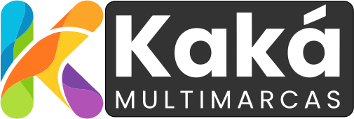

# Kaká Multimarcas



## Overview
Bem-vindo ao projeto **`KAKAMULTIMARCAS`**, o frontend do e-commerce **Kaká Multimarcas**.
Ele foi desenvolvido como um protótipo visual e funcional para demonstrar:
- catálogo de produtos,
- página de produto,
- carrinho e checkout,
- painel de usuário,
- filtros e busca inteligente.

> O frontend usa dados mockados em `src/data.ts` e entrega uma experiência completa de loja. A integração backend ainda está em progresso.

---

## Status do Projeto
### Build e execução
- ✅ `npm install` funciona
- ✅ `npm run dev` executa localmente
- ✅ `npm run build` gera o bundle de produção

### Desenvolvimento geral
- [x] Estrutura de frontend com React + TypeScript
- [x] Componentização de layout e páginas
- [x] Catálogo de produtos com filtros
- [x] Página de produto com galeria e zoom
- [x] Carrinho e checkout simulados
- [x] Autenticação mock e painel de cliente
- [ ] Rotas reais por URL
- [ ] Integração com backend real
- [ ] Pagamento real

### Progresso do projeto
- Frontend: **85%**
- Mock data e UI: **100%**
- Integração backend: **25%**
- Checkout real/gateway: **10%**

---

## Integração com Backend
Este projeto ainda não consome uma API real.
A arquitetura atual foi feita para facilitar a conexão futura com um backend, mas hoje:
- os produtos vêm de `src/data.ts`
- o carrinho e checkout são simulados localmente
- autenticação é mockada no client

### Progresso da integração
- [x] Definição do contrato de produto mock
- [ ] Conexão de catálogo com API REST
- [ ] Autenticação real com JWT/sessão
- [ ] Checkout integrado com gateway de pagamento
- [ ] Persistência de pedidos em backend

---

## Tecnologias usadas
- React 19
- Vite 6
- TypeScript 5.x
- Tailwind CSS 4
- Lucide React
- Docker (build de produção)

---

## Funcionalidades principais
### Loja
- Página inicial com slider e ofertas
- Busca inteligente com sugestões
- Filtro por categoria, marca, cor, preço e rating
- Paginação simulada com "carregar mais"

### Produto
- Detalhes completos do produto
- Galeria de imagens com miniaturas
- Seletor de cor e tamanho
- Preço promocional e economia calculada
- FAQ e avaliações simuladas

### Carrinho & Checkout
- Adição, remoção e edição de itens
- Persistência em `localStorage`
- Checkout multi-etapa
- Variação de frete e total dinâmico
- Simulação de pagamento por PIX, cartão e boleto

### Conta do Cliente
- Modal de login/cadastro
- Painel com perfil e histórico
- Wishlist e cashback simulado

---

## Estrutura do projeto
```text
src/
├── App.tsx
├── components/
│   ├── AuthModal.tsx
│   ├── BrandsView.tsx
│   ├── CartView.tsx
│   ├── CategoryView.tsx
│   ├── CheckoutView.tsx
│   ├── DashboardView.tsx
│   ├── Footer.tsx
│   ├── Header.tsx
│   ├── HomeView.tsx
│   ├── ProductCard.tsx
│   ├── ProductDetailView.tsx
│   ├── PromoView.tsx
│   └── InstitutionalView.tsx
├── data.ts
├── types.ts
├── useAutoZoom.ts
├── index.css
└── main.tsx
```

---

## Instalação e execução
```bash
cd site
npm install
npm run dev
```

### Build de produção
```bash
cd site
npm run build
```

### Docker
```bash
cd site
docker build -t kaka-multimarcas-site .
docker run -p 3000:3000 kaka-multimarcas-site
```

---

## Observações finais
- A logo está incluída no topo do README usando `assets/images/logo.png`.
- O layout agora é mais completo e focado em roadmap de integração.
- O projeto está pronto para conectar a um backend real quando a API estiver disponível.
